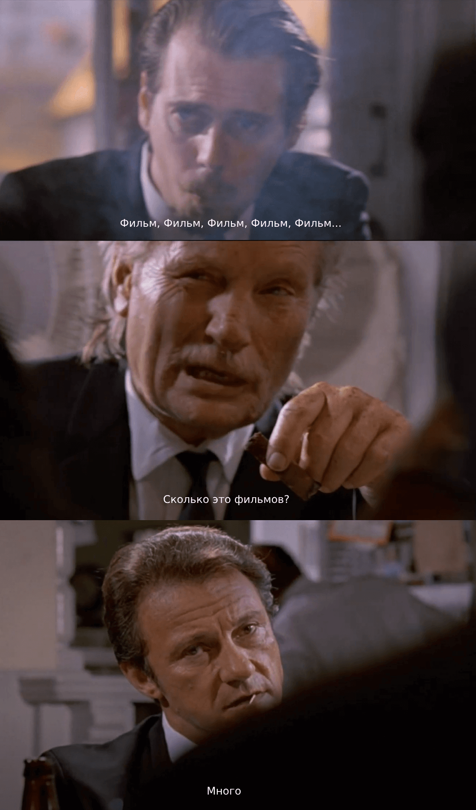

# проект Frontend movies (в рамках дипломной работы Яндекс.Практикум)
Совместный проект Яндекс.Практикум и Beat Film Festival.
Приложение для поиска среди фильмов-участников фестиваля с возможностью сохранить понравившиеся работы.

### На основе:
* CSS
* JS
* React

### Функционал:
* Регистрация пользователей
* Авторизация пользователей
* Просмотр пользователя (основных данных)
* Просмотр списка фильмов
* Просмотр списка любимых фильмов

## Доступ к проекту
Полный сайт: https://movies-reras.students.nomoredomains.rocks

Бек: https://github.com/ilia-puchkov/movies-explorer-api
